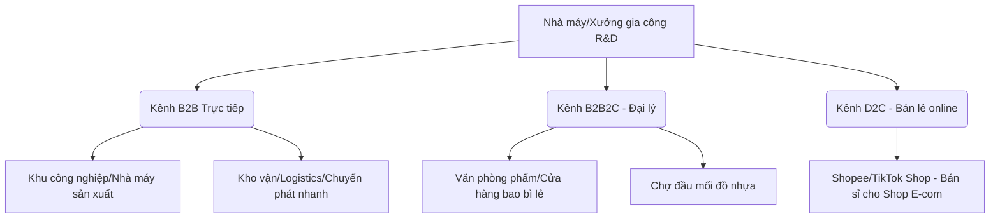

# Khảo sát Thị trường Băng dính & Màng co Việt Nam (Vietnam Market Research)

Tài liệu này tổng hợp thông tin nghiên cứu thị trường, chân dung khách hàng, đối thủ cạnh tranh chính và các kênh phân phối cho dòng sản phẩm Băng dính & Màng co tại Việt Nam.

---

## 1. Xu hướng và Dung lượng Thị trường (Market Drivers & Volume)

Nhu cầu tiêu dùng bao bì đóng gói phụ trợ tại Việt Nam tăng trưởng liên tục từ 10% - 15% mỗi năm nhờ các động lực cốt lõi sau:
1.  **Sự bùng nổ của Thương mại điện tử (E-commerce):** Hàng triệu đơn hàng phát sinh mỗi ngày từ các sàn Shopee, TikTok Shop, Lazada cần đóng gói bằng thùng carton bọc băng dính và túi chống sốc co màng.
2.  **Chuỗi Logistics & Kho vận mở rộng:** Các trung tâm phân phối lớn (Lazada Express, Shopee SPX, Giao Hàng Nhanh, Viettel Post, DHL) tiêu thụ lượng cực lớn màng PE quấn pallet để lưu trữ và luân chuyển hàng hóa.
3.  **Hoạt động sản xuất công nghiệp và xuất khẩu:** Việt Nam là trung tâm sản xuất giày da, dệt may, linh kiện điện tử lớn của khu vực. Mọi kiện hàng xuất khẩu đi Mỹ, EU, Nhật Bản đều bắt buộc phải quấn màng bảo vệ và dán niêm phong bằng băng keo chất lượng cao.

---

## 2. Đối thủ Cạnh tranh Chính tại Việt Nam (Key Competitors)

Thị trường phân chia rõ rệt thành các doanh nghiệp có nhà máy đùn/tráng keo lớn và các đơn vị gia công nhỏ lẻ (chỉ mua cuộn Jumbo về cắt cuộn nhỏ):

*   **Hanopro (Tập đoàn Hanopro):**
    *   *Thế mạnh:* Thương hiệu lâu đời nhất miền Bắc. Nhà máy quy mô lớn tại Hà Nội và Hải Phòng. Xuất khẩu mạnh đi Hàn Quốc, Nhật Bản. Đầy đủ chứng chỉ kiểm định chất lượng quốc tế.
    *   *Sản phẩm:* Băng keo các loại (in logo, chịu nhiệt), màng PE stretch, hạt hút ẩm.
*   **Việt Box (TP.HCM):**
    *   *Thế mạnh:* Vô cùng mạnh về phân phối trực tuyến B2B/B2C tại thị trường phía Nam. Giá thành siêu rẻ cho phân khúc shop bán lẻ trực tuyến. Quy trình mua hàng tự động hóa tốt.
    *   *Sản phẩm:* Thùng carton, băng keo OPP, màng PE bọc hàng.
*   **Song Mã (Hải Phòng - Stretch Film Song Mã):**
    *   *Thế mạnh:* Chuyên sâu sản xuất màng co, màng quấn PE stretch phục vụ khu công nghiệp Hải Phòng, Quảng Ninh.
*   **Các đại lý gia công không thương hiệu tại chợ đầu mối (Chợ Bình Tây, chợ Đồng Xuân):**
    *   *Đặc điểm:* Cạnh tranh thuần túy về giá. Thường sử dụng lõi giấy pha bột đá siêu dày (nặng đến 1kg lõi cho cuộn băng keo 2kg) nhằm mục đích bán theo cân nặng nhưng độ dài dây keo cực ngắn.

---

## 3. Kênh Phân phối Mục tiêu (Distribution Channels)

Chúng ta có thể tiếp cận thị trường qua 3 kênh chính sau:

---

## 4. Các Vấn đề bức xúc của Khách hàng (Customer Pain Points)

Để cạnh tranh thắng lợi, sản phẩm của dự án R&D cần khắc phục các lỗi cố hữu của các sản phẩm giá rẻ trên thị trường:

1.  **Chất lượng keo không đồng đều (Adhesion Failures):**
    *   *Vấn đề:* Băng dính giá rẻ dễ bị bong keo khi gặp thời tiết lạnh (lưu kho đông lạnh) hoặc thời tiết nắng nóng (vận chuyển container). Nhiều loại keo bị khô trơ sau 2-3 tháng lưu kho.
    *   *Giải pháp R&D:* Sử dụng keo Acrylic hệ nước chất lượng cao chống lão hóa nhiệt, độ bám dính đảm bảo trên $\ge 5.0$ N/25mm.
2.  **Màng dập dễ đứt (Tensile Failures):**
    *   *Vấn đề:* Màng BOPP cán mỏng quá hoặc không đều khi kéo mạnh để dán thùng bằng dao cầm tay thường bị rách rách ngang giữa chừng gây gián đoạn đóng gói.
    *   *Giải pháp R&D:* Đảm bảo độ dày màng BOPP thô $\ge 25$ micron trước khi phủ keo.
3.  **Lõi giấy gian lận (Paper Core Fraud):**
    *   *Vấn đề:* Khách hàng rất mệt mỏi với việc mua băng dính theo "cân nặng" nhưng lõi giấy chiếm 50% khối lượng.
    *   *Giải pháp R&D:* Định vị thương hiệu minh bạch: **Bán theo mét/yard thật**, sử dụng lõi mỏng tiêu chuẩn (3-4mm), lõi nhựa nhẹ thay lõi giấy để cam kết đúng chiều dài.
4.  **Màng PE bị rách ở góc pallet (Puncture Failures):**
    *   *Vấn đề:* Màng PE kém dai khi quấn góc nhọn của thùng carton hoặc pallet gỗ thường bị xé rách toạc, mất khả năng cố định kiện hàng.
    *   *Giải pháp R&D:* Sử dụng 100% nhựa LLDPE nguyên sinh nhập khẩu để tăng cường độ dai chịu đâm thủng.

---

## 5. Nghiên cứu Sâu Thị trường Hải Phòng (Hai Phong Local Market Study)

Hải Phòng là thị trường bao bì công nghiệp trọng điểm bậc nhất miền Bắc nhờ vị thế là **Thành phố cảng biển lớn nhất** và **Trung tâm sản xuất FDI, Logistics hàng đầu**. 

### A. Bản đồ Nhu cầu theo các Phân khu Công nghiệp & Cảng biển
Nhu cầu tiêu thụ băng dính và màng PE tập trung tại các cụm công nghiệp lớn với các đặc thù khác nhau:

1.  **Các Cảng biển & Kho bãi Logistics (Cảng Lạch Huyện, Đình Vũ, Chùa Vẽ...):**
    *   *Sản phẩm chủ lực:* **Màng PE quấn pallet (Stretch Film)**.
    *   *Đặc trưng:* Ki kiện hàng lưu bãi ngoài trời hoặc xếp trong container đi biển dài ngày cần màng PE bọc kín để **chống hơi muối biển**, chống ẩm và chống bụi bẩn. Nhu cầu màng quấn máy cuộn lớn (10kg - 15kg) rất cao để đóng gói pallet tốc độ nhanh.
2.  **Tổ hợp công nghiệp Điện tử - Công nghệ cao (KCN Tràng Duệ, KCN VSIP Hải Phòng):**
    *   *Khách hàng tiêu biểu:* Tổ hợp nhà máy LG (LG Electronics, LG Display, LG Innotek), Pegatron, Kyocera...
    *   *Sản phẩm chủ lực:* Băng dính dán thùng OPP chất lượng cao (không đứt nửa chừng), **Băng dính cách điện/ESD (chống tĩnh điện)**, màng PE quấn pallet và màng co nhiệt POF bảo vệ hộp sản phẩm xuất khẩu.
3.  **Ngành công nghiệp truyền thống (Dệt may, Da giày tại KCN Nomura, KCN An Dương):**
    *   *Sản phẩm chủ lực:* Băng dính OPP trong/đục bản rộng 48mm, băng dính in logo niêm phong thùng carton chống mất cắp hàng hóa.

### B. Đặc điểm Cạnh tranh Cục bộ tại Hải Phòng
Tại Hải Phòng, cuộc cạnh tranh diễn ra khốc liệt giữa các xưởng sản xuất tại chỗ và các đơn vị thương mại trung gian:

*   **Lợi thế JIT (Just-In-Time) của xưởng local:**
    Các nhà máy FDI trong KCN thường yêu cầu giao hàng cực kỳ nhanh (trong vòng 4 - 8 giờ sau khi đặt hàng) để tránh gián đoạn dây chuyền đóng gói. Do đó, các đơn vị có kho hàng hoặc xưởng chia cuộn trực tiếp tại Hải Phòng (như ACP An Dương, Song Mã) có lợi thế vượt trội so với các công ty từ Hà Nội hay Hưng Yên chuyển xuống.
*   **Chiến lược bán hàng "Trọn gói giải pháp" (Bundle Sales):**
    Các doanh nghiệp mua hàng công nghiệp ưu tiên ký hợp đồng với 1 nhà cung cấp duy nhất có thể cấp toàn bộ vật tư đóng gói: Băng dính + Màng PE + Dây đai nhựa (PP/PET) + Xốp bong bóng (Bubble wrap) + Thanh nẹp góc giấy. Các nhà cung cấp địa phương như ACP và Vĩnh Xuyên thành công nhờ đa dạng hóa danh mục sản phẩm này.

### C. Cơ hội và Định hướng cho dự án R&D của chúng ta
Để thâm nhập thị trường Hải Phòng thành công, chúng ta cần xây dựng mô hình sản phẩm hướng đến:
1.  **Dịch vụ mẫu thử miễn phí (Free Sampling Program):** Các phòng mua hàng (Procurement) của nhà máy FDI luôn yêu cầu test mẫu màng PE quấn pallet xem có bị rách khi chạy máy căng $300\%$ hay không. Chúng ta cần chuẩn bị sẵn mẫu test chuẩn chỉ.
2.  **Đại lý vệ tinh sát KCN:** Hợp tác phân phối với các đơn vị bảo hộ lao động lớn ngay cạnh các KCN Tràng Duệ và VSIP Hải Phòng để tận dụng năng lực kho bãi và giao hàng siêu tốc của họ.
3.  **Cam kết chất lượng màng LLDPE nguyên sinh:** Đánh vào phân khúc hàng chất lượng cao cho xuất khẩu đi các thị trường khó tính (Mỹ, Châu Âu), cam kết màng không mùi hôi, không dùng nhựa tái chế gây rách bẩn sản phẩm của khách hàng.

### D. Khảo sát Giá sỉ/lẻ tham khảo tại Hải Phòng (Local Pricing Reference)
Khảo sát sơ bộ mặt bằng giá cung ứng vật tư đóng gói tại các đại lý và khu vực bán sỉ Hải Phòng (Áp dụng cho đơn hàng số lượng vừa và nhỏ):

| Tên sản phẩm | Quy cách tiêu chuẩn | Giá bán sỉ đại lý (VND) | Giá bán lẻ đề xuất (VND) |
| :--- | :--- | :--- | :--- |
| **Băng dính OPP Trong/Đục** | 48mm × 100 Yard (Độ dày 48mic) | 7.200 - 8.500 / cuộn | 10.000 - 12.000 / cuộn |
| **Băng dính OPP Trong/Đục** | 48mm × 200 Yard (Độ dày 48mic) | 13.800 - 15.500 / cuộn | 18.000 - 22.000 / cuộn |
| **Màng PE quấn tay** | Cuộn 2.4kg (Lõi giấy 0.4kg - Màng 17mic) | 75.000 - 82.000 / cuộn | 95.000 - 110.000 / cuộn |
| **Màng PE quấn máy** | Cuộn 15.0kg (Lõi giấy 1.2kg - Màng 23mic) | 460.000 - 495.000 / cuộn | 540.000 - 580.000 / cuộn |
| **Màng co nhiệt POF** | Khổ 400mm × 1332m (Độ dày 15mic) | 720.000 - 750.000 / cuộn | 820.000 - 890.000 / cuộn |

