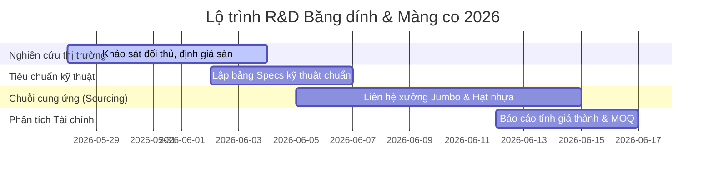

# Lộ trình Nghiên cứu & Phát triển Băng dính + Màng co (R&D Roadmap)

Tài liệu này xác định mục tiêu, các cột mốc quan trọng (Milestones) và quy trình thực thi từng phần đối với hoạt động nghiên cứu phát triển dòng sản phẩm Băng dính & Màng co tại thị trường Việt Nam.

---

## 🎯 Mục tiêu dự án (Project Goals)
1. **Thiết lập hồ sơ kỹ thuật chuẩn:** Xây dựng danh sách thông số kỹ thuật (microns, yards, GSM, chất liệu màng và keo) phù hợp với nhu cầu cao nhất của thị trường đóng gói (E-commerce, Logistics, Quấn Pallet công nghiệp).
2. **Tối ưu hóa bài toán kinh tế (Costing & Margin):** Tính toán giá thành dựa trên 2 phương án: Nhập khẩu gia công (OEM/ODM) vs Tự sản xuất thô. Tìm điểm hòa vốn và định giá bán buôn/bán lẻ tối ưu.
3. **Tuyển chọn chuỗi cung ứng tin cậy:** Xác định danh sách các nhà máy đùn màng PE/POF lớn tại Việt Nam và các đầu mối cung cấp Jumbo roll/keo acrylic từ Trung Quốc/Hàn Quốc.

---

## 📅 Các mốc thời gian và Các Phase triển khai (Project Phases)

### Phase 1: Nghiên cứu thị trường & Phân khúc (Khởi chạy ngay)
- **Mục tiêu:** Định vị phân khúc giá bán lẻ trên các sàn e-commerce và phân khúc bán sỉ B2B cho doanh nghiệp.
- **Nhiệm vụ:**
  - Thu thập giá bán trung bình của băng dính OPP (trong suốt, đục, màu, in logo) và màng PE quấn hàng (cuộn nhỏ 1kg, 2kg, 3.8kg, cuộn lớn quấn máy 15kg).
  - Phân tích các đánh giá tiêu cực của khách hàng trên sàn thương mại điện tử đối với các thương hiệu hiện có (lỗi keo yếu, màng dễ rách, lõi giấy quá dày để gian lận cân nặng) để cải tiến chất lượng.
- **Đầu ra:** Báo cáo [market_research/vietnam_market.md](file:///Users/minhcuong/.openclaw/workspace/rd_tape_shrinkwrap/market_research/vietnam_market.md).

### Phase 2: Đặc tính kỹ thuật & Hồ sơ sản phẩm
- **Mục tiêu:** Xác lập chính xác các thông số kỹ thuật chuẩn hóa để làm việc với các nhà cung cấp/OEM.
- **Nhiệm vụ:**
  - Quy chuẩn độ dày màng BOPP và keo Acrylic tổng cộng (ví dụ: 43 micron, 48 micron, 50 micron).
  - Quy chuẩn tỷ lệ co nhiệt của màng POF/PVC/PET để ứng dụng cho máy co màng nhiệt tự động.
- **Đầu ra:** 
  - [technical_specs/adhesive_tape.md](file:///Users/minhcuong/.openclaw/workspace/rd_tape_shrinkwrap/technical_specs/adhesive_tape.md)
  - [technical_specs/shrink_wrap.md](file:///Users/minhcuong/.openclaw/workspace/rd_tape_shrinkwrap/technical_specs/shrink_wrap.md)

### Phase 3: Tìm nguồn cung ứng (Sourcing & RFQ)
- **Mục tiêu:** Lấy báo giá chi tiết từ các nhà máy/đối tác tiềm năng.
- **Nhiệm vụ:**
  - Lập danh sách nhà sản xuất Jumbo roll băng dính trong nước và Trung Quốc (như qua Alibaba).
  - So sánh giá hạt nhựa LLDPE nguyên sinh (Sabic, ExxonMobil) phục vụ sản xuất màng PE.
  - Xin báo giá máy cắt băng keo và máy chia cuộn PE mini.
- **Đầu ra:** Báo cáo [sourcing_costing/suppliers_leads.md](file:///Users/minhcuong/.openclaw/workspace/rd_tape_shrinkwrap/sourcing_costing/suppliers_leads.md).

### Phase 4: Thiết lập mô hình tài chính & Kế hoạch sản xuất
- **Mục tiêu:** Xác định lợi nhuận gộp, điểm hòa vốn và phương thức sản xuất tối ưu.
- **Nhiệm vụ:**
  - Lập bảng tính Excel/CSV chi tiết chi phí nguyên liệu + khấu hao lõi giấy + nhân công + điện năng + bao bì đóng gói.
  - So sánh chi phí giữa tự sản xuất (cần vốn lớn mua máy đùn thổi) và OEM (đơn hàng tối thiểu MOQ nhỏ hơn).
- **Đầu ra:** Tệp phân tích tài chính `sourcing_costing/financial_model.csv` (sẽ được tạo ở Phase này).

---

## 👥 Phân bổ trách nhiệm của Agent (Responsibility Matrix)

Để đảm bảo hiệu quả làm việc tự động và tối ưu hóa hệ thống Agent hiện tại của Tập đoàn Minh Cường:

| Nội dung công việc | Owner | Mô tả chi tiết hành động |
| :--- | :--- | :--- |
| **Market Research (Shopee, TikTok Shop, Alibaba)** | **BÚN** | Sử dụng năng lực nghiên cứu sản phẩm để thu thập thông tin giá bán lẻ, dung lượng thị trường và giá nhập sỉ từ các xưởng lớn của Trung Quốc. |
| **Thiết lập Specs Kỹ thuật & Standards** | **Trợ Lý** | Tổng hợp các bộ tiêu chuẩn quốc tế và quy đổi đơn vị đo lường chính xác cho sản phẩm. |
| **Soạn thảo và Tổng hợp báo cáo R&D** | **Trợ Lý** | Viết cấu trúc dữ liệu, kiểm tra lỗi logic và lập biểu đồ tiến độ. |
| **Giám sát chất lượng và Quản lý vận hành** | **Trợ Lý** | Điều phối tiến trình của Bún, nghiệm thu và đề xuất báo cáo định kỳ cho Henry. |
