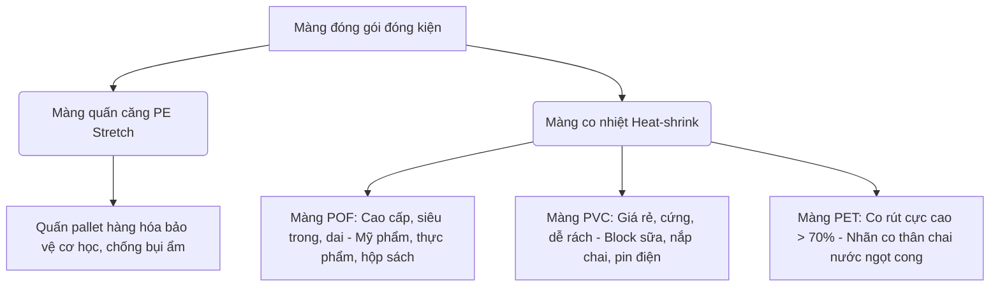

# Cẩm nang Hướng dẫn & Nghiên cứu Kỹ thuật Sản phẩm (R&D Product Guide)

Cẩm nang này cung cấp kiến thức nền tảng về lựa chọn chất liệu bao bì đóng gói, các chỉ số kỹ thuật chính, phương pháp kiểm tra chất lượng (QC) nhanh tại kho nhận hàng, cùng các công thức tính toán quy đổi quy cách tiêu chuẩn.

---

## 1. Hướng dẫn Lựa chọn Vật liệu đóng gói (Material Selection Guide)

### A. Phân khúc Băng dính (Adhesive Tapes)
*   **Dán thùng carton carton giấy tái chế thô:** Ưu tiên băng dính OPP có độ dày **$\ge 48$ micron** phủ keo acrylic dày hoặc keo cao su tự nhiên để bám chắc vào các xơ giấy carton thô.
*   **Che chắn bề mặt phun sơn sấy nhiệt:** Chọn **Băng dính Giấy (Masking Tape)** chịu nhiệt độ cao. Tránh dùng băng dính OPP vì keo sẽ chảy lỏng và bám chặt vào bề mặt kim loại dưới nhiệt độ cao của lò sấy.
*   **Lắp ráp chịu lực không dùng đinh:** Chọn **Băng dính xốp/Acrylic hai mặt cường lực** dạng xốp đặc Acrylic Foam.
*   **Chằng buộc hàng sắt thép nặng:** Chọn **Băng dính Sợi thủy tinh** chịu lực cực cao để không bị đứt khi cọ sát với cạnh sắc của sắt thép.

### B. Phân khúc Màng co & Màng quấn (Shrink & Stretch Films)

---

## 2. Các phương pháp thử nghiệm chất lượng (Physical Testing Methods)

Để đánh giá chất lượng băng dính/màng co một cách khoa học trong phòng thí nghiệm R&D, chúng ta sử dụng các phương pháp thử nghiệm tiêu chuẩn:

1.  **Thử nghiệm lực bám dính (Peel Adhesion Test - ASTM D3330):**
    *   *Cách làm:* Dán một dải băng keo rộng 25mm lên tấm thép tiêu chuẩn bằng con lăn nặng 2kg, sau đó dùng máy kéo vạn năng lột băng dính ra ở góc $180^\circ$ hoặc $90^\circ$ với tốc độ cố định. Lực cản lột ra được ghi nhận bằng đơn vị N/25mm.
2.  **Thử nghiệm độ dính ban đầu (Ball Tack Test - JIS Z0237):**
    *   *Cách làm:* Cho một viên bi thép tiêu chuẩn lăn xuống từ một dốc nghiêng $30^\circ$ vào bề mặt keo của dải băng dính. Viên bi dừng lại càng nhanh (khoảng cách lăn càng ngắn, ví dụ dưới 100mm) chứng tỏ độ dính ướt ban đầu của keo càng tốt.
3.  **Thử nghiệm độ bền kéo và độ giãn dài (Tensile Strength & Elongation - ASTM D882 / D3759):**
    *   *Cách làm:* Kéo dải màng PE hoặc băng keo đến khi đứt hoàn toàn. Đo lực kéo tối đa trước khi đứt (Tensile) và tỷ lệ phần trăm chiều dài tăng thêm trước khi đứt (Elongation). Màng PE Stretch tốt có độ giãn dài $\ge 300\%$.
4.  **Thử nghiệm độ co nhiệt (Heat Shrinkage Test - ASTM D2732):**
    *   *Cách làm:* Cắt mẫu màng co POF/PVC kích thước $10cm \times 10cm$, nhúng vào bể dầu nhiệt độ $120^\circ C - 150^\circ C$ trong 5 giây. Đo kích thước co lại theo chiều dọc (MD) và chiều ngang (TD) để tính tỷ lệ phần trăm co ngót.

---

## 3. Phương pháp QC nhanh tại kho (Quick Warehouse Acceptance QC)

Khi nhận hàng số lượng lớn từ nhà cung cấp/xưởng gia công, nhân viên kho có thể áp dụng các mẹo QC nhanh sau để phát hiện hàng gian lận chất lượng:

### A. Đối với Băng dính
1.  **Kiểm tra độ dày lõi và cân nặng lõi:**
    *   Cắt dọc cuộn băng dính để lấy lõi giấy ra cân riêng. Nếu cuộn băng dính nặng 1.2kg mà lõi giấy nặng tới 0.4kg - 0.5kg (dày > 6mm) thì đó là hàng gian lận chiều dài.
2.  **Kiểm tra độ bám dính thực tế:**
    *   Dán thử băng dính lên mặt thùng carton tái chế thô bụi. Dùng tay miết nhẹ. Nếu băng dính tự bung mép chỉ sau 30 phút, keo đó có độ dính cực kém hoặc tỷ lệ dung môi bay hơi quá nhanh.
3.  **Công thức kiểm tra độ dài dây keo thật ($L$):**
    Nếu không có máy cuộn để đo chiều dài, có thể áp dụng công thức toán học hình cuộn tròn:
    
    $$L = \frac{\pi \times (D^2 - d^2)}{4 \times t}$$
    
    *   Trong đó:
        *   $L$: Chiều dài dây băng keo cần tính (mét).
        *   $D$: Đường kính ngoài của cuộn băng keo (mét).
        *   $d$: Đường kính ngoài của lõi giấy/nhựa (mét).
        *   $t$: Độ dày tổng cộng của dải băng keo (ví dụ: 48 micron = $0.000048$ mét).
        *   $\pi \approx 3.1416$.

### B. Đối với Màng PE Stretch
1.  **Cân trọng lượng thô và trọng lượng lõi:**
    *   Trọng lượng màng thực tế = Tổng trọng lượng cuộn - Trọng lượng lõi giấy. Hãy đảm bảo xưởng không dùng lõi giấy ngậm nước siêu nặng để gian lận khối lượng màng.
2.  **QC độ dai chịu đâm thủng bằng vật tù:**
    *   Dùng ngón tay cái ấn mạnh vào màng PE đang được kéo căng. Nếu màng giãn dài ôm trọn ngón tay mà không bị bục rách toạc ngay lập tức, màng có độ dai tốt (LLDPE nguyên sinh chuẩn).

---

## 4. Công thức quy đổi đo lường ngành bao bì đóng gói

*   **Chiều dài:**
    *   $1 \text{ Yard} = 0.9144 \text{ mét}$.
    *   *Ví dụ:* Cuộn băng dính $100 \text{ Yard} \approx 91.4 \text{ mét}$.
*   **Độ dày:**
    *   $1 \text{ micron } (\mu m) = 0.001 \text{ mm} = 0.000039 \text{ inch}$.
    *   *Ví dụ:* Độ dày màng co 15 micron tương đương $0.015 \text{ mm}$.
*   **Công thức tính trọng lượng lý thuyết của màng PE ($W$):**
    
    $$W \text{ (kg)} = W_i \text{ (m)} \times L \text{ (m)} \times T \text{ (mm)} \times d \text{ (g/cm}^3\text{)}$
    
    *   Trong đó:
        *   $W_i$: Chiều rộng cuộn màng (mét).
        *   $L$: Chiều dài dải màng (mét).
        *   $T$: Độ dày màng (mm - ví dụ: 17 micron = $0.017 \text{ mm}$).
        *   $d$: Khối lượng riêng của hạt nhựa PE thô (xấp xỉ $0.92 \text{ g/cm}^3$ đối với LLDPE).
